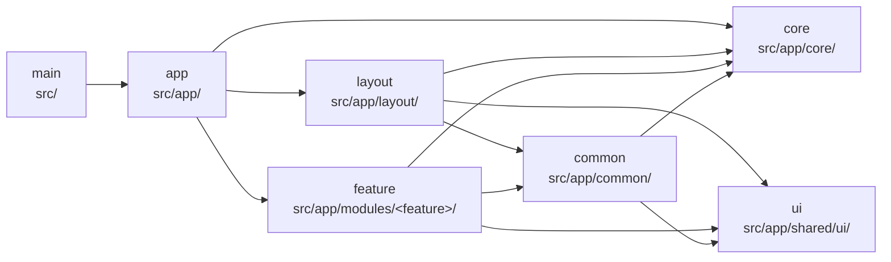
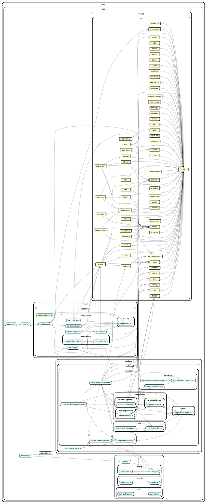

# Angular Monolithic Starter

An opinionated Angular 22 starter for building a modular monolith. It includes a customizable UI system, enforced module boundaries, bundle and dependency analysis, local quality gates, containerized runtime configuration, and continuous integration.

<!-- TEMPLATE-ONLY:START -->

## Create a project from this template

This repository is configured as a GitHub template. If the GitHub CLI is installed, create and
clone a repository with:

```bash
gh repo create my-new-app \
  --template phhien203/ng-monolithic-starter \
  --private \
  --clone
cd my-new-app
```

Without the GitHub CLI, open
[phhien203/ng-monolithic-starter](https://github.com/phhien203/ng-monolithic-starter) on GitHub,
select **Use this template → Create a new repository**, choose the repository name and visibility,
and select **Create repository**. Then copy the new repository's URL from its **Code** menu and clone
it with Git:

```bash
git clone https://github.com/YOUR_GITHUB_USERNAME/my-new-app.git
cd my-new-app
```

Initialize the copied workspace before installing dependencies. The first argument is the lowercase kebab-case package and Angular project name. The optional second argument is the human-readable application title; when omitted, it is derived from the project name.

```bash
pnpm template:init my-new-app "My New App"
pnpm install
pnpm start
```

The initializer updates `package.json`, `angular.json`, Docker build paths, the browser title, and this README. It can only run once. Commit the initialized files as the first application-specific commit.

Repository owners can enable template mode under **Settings → General → Template repository**. See GitHub's [template repository documentation](https://docs.github.com/en/repositories/creating-and-managing-repositories/creating-a-template-repository) for access and repository-creation options.
<!-- TEMPLATE-ONLY:END -->

## Update a project from this template

GitHub does not keep a Git relationship between a template repository and repositories created
from it. Add this repository as a `template` remote once so that future template changes can be
merged into the project.

For a newly created project, establish the relationship before running `template:init`, while its
files still match the template:

```bash
git remote add template https://github.com/phhien203/ng-monolithic-starter.git
git fetch template
git merge template/main --allow-unrelated-histories
```

The `--allow-unrelated-histories` option is needed only for this first merge. Afterward, initialize
the application with `pnpm template:init`, then commit the project-specific changes.

To bring later template changes into the project, create a synchronization branch and merge the
latest template version:

```bash
git switch main
git pull --ff-only origin main
git switch -c chore/sync-template
git fetch template
git merge template/main
```

Resolve conflicts carefully so that application-specific names, configuration, and features are
preserved. Then install the locked dependencies and run the full quality gate:

```bash
pnpm install --frozen-lockfile
pnpm verify
git push -u origin chore/sync-template
```

Review and merge the synchronization branch through a pull request. If the project was already
initialized before adding the `template` remote, use `--allow-unrelated-histories` for its first
template merge and expect to resolve conflicts in files changed by `template:init`.

## What is included

| Part                            | Purpose                                                                                                             |
| ------------------------------- | ------------------------------------------------------------------------------------------------------------------- |
| Angular 22                      | Standalone Angular application using the modern application builder, router, Vitest, and strict TypeScript tooling. |
| NgRx Signal Store               | Signal-based application state with a typed, root-provided authentication store.                                    |
| spartan/ui                      | Accessible UI primitives and project-owned styled components, integrated with Tailwind CSS 4.                       |
| Sentry                          | Runtime-configured error reporting, tracing, session replay, logs, and metrics for the browser application.         |
| Bundle analyzer                 | Generates an interactive HTML report from Angular build statistics with `esbuild-visualizer`.                       |
| Dependency graph analyzer       | Renders full or scoped source dependency graphs with dependency-cruiser and Graphviz.                               |
| Module boundaries               | Enforces the modular-monolith dependency rules with ESLint during local development and CI.                         |
| Pre-commit hook                 | Runs ESLint and Prettier on staged files with Husky and lint-staged.                                                |
| Docker with runtime environment | Produces an nginx image whose public configuration is injected when the container starts.                           |
| GitHub Actions                  | Checks formatting, linting, unit tests, and the production build on pushes and pull requests.                       |

## Architecture tradeoffs

This starter uses a modular-monolith architecture: the application is built and deployed as one Angular application, while features are separated by explicit, lint-enforced dependency boundaries.

### Pros

- **Simple delivery and operations:** one application, build pipeline, runtime configuration, and deployment artifact are easier to operate than multiple independently deployed frontends.
- **Clear feature ownership:** feature code is colocated under `src/app/modules/<feature>`, and cross-feature imports are prohibited to reduce accidental coupling.
- **Low-cost code sharing:** features can reuse application-wide services, domain-neutral components, and UI primitives without package publishing or version coordination.
- **Atomic changes:** updates that span several features, shared code, and routing can be implemented, tested, and released together.
- **Incremental scalability:** lazy-loaded routes and enforced dependency directions allow the codebase and team to grow without introducing distributed-system overhead prematurely.
- **Straightforward local development:** developers run and debug the complete application in one workspace with a consistent toolchain.

### Cons

- **Coupled releases:** every change is shipped through the same pipeline, so features cannot be independently versioned, deployed, or rolled back.
- **Shared failure domain:** a build failure, dependency upgrade, or runtime regression can affect the whole application.
- **Repository growth:** builds, tests, dependency graphs, and developer navigation can become slower as the application and copied UI catalog expand.
- **Boundary discipline is still required:** lint rules constrain imports, but they cannot prevent all coupling through shared state, APIs, naming conventions, or overly broad `core` and `common` modules.
- **Shared-code pressure:** reusable code can accumulate in common areas without a clear owner, making those areas harder to change safely.
- **Limited team autonomy at scale:** teams share framework versions, dependencies, CI capacity, and release timing; organizations needing independent delivery may eventually prefer separately deployed applications or micro-frontends.

This architecture is a strong fit when features belong to one product, benefit from coordinated releases, and can share an Angular stack. It is less suitable when teams require independent deployment, separate technology choices, or strict runtime isolation.

## Requirements

- Node.js 24
- pnpm 11.5.2, as declared by the `packageManager` field in `package.json`
- Graphviz when generating dependency graph SVGs
- Docker when building or running the production container

Install dependencies and start the development server:

```bash
pnpm install
pnpm start
```

Open `http://localhost:4200`. The development server reloads when source files change.

## Angular 22

The starter uses Angular 22.1 and Angular CLI 22.1.2. It is structured as a standalone application and includes:

- Angular Router with lazy-loaded feature routes
- Vitest through Angular's unit-test builder
- Angular ESLint, including template accessibility rules
- production bundle budgets and source maps
- Prettier with Tailwind CSS class sorting

Common commands:

```bash
pnpm start          # Start the development server
pnpm build          # Create a production build in dist/
pnpm test           # Run unit tests
pnpm lint           # Run ESLint and module-boundary checks
pnpm format         # Format project files
pnpm format:check   # Check formatting without changing files
pnpm verify:quick   # Run lint and unit tests while iterating
pnpm verify         # Run the complete CI quality gate
```

Application-wide state uses NgRx Signal Store. The root-provided `AuthState` in
`src/app/core/auth/auth-state.ts` exposes the current `user`, the derived
`isAuthenticated` signal, and `setUser`/`clearUser` methods.

Generate Angular code with the CLI, for example:

```bash
pnpm ng generate component component-name
```

## Agent workflow

`AGENTS.md` is the entry point for coding agents. It documents the architecture, Angular and
spartan/ui conventions, validation expectations, and definition of done. Scoped instruction files
under `src/app` add rules for feature modules, core infrastructure, layout, and the project-owned UI
system.

The products feature is a reference slice for lazy route loading, explicit loading/success/empty/error
view states, accessible spartan/ui composition, and component/router testing. Before handing off a
change, run the same deterministic quality gate as CI:

```bash
pnpm verify
```

The checked-in MCP configuration uses the exact local Angular and spartan MCP dependencies through
pnpm, so component and framework discovery does not float to an unreviewed package version.

## spartan/ui

[spartan/ui](https://www.spartan.ng/) is chosen because it combines accessible behavior with full ownership of the visual implementation:

- **Brain** (`@spartan-ng/brain`) supplies accessible, headless Angular primitives and interaction behavior.
- **Helm** supplies styled components that are copied into `src/app/shared/ui`, rather than hidden inside a package. The application can change their markup, variants, and styles without wrapping or forking a third-party component library.
- Tailwind CSS 4, semantic design tokens, and CSS variables make application-wide theming explicit and easy to adapt, including dark mode.
- Components remain idiomatic Angular directives and components, while accessibility-heavy behavior stays maintained by the library.

The starter includes the spartan component catalog under `src/app/shared/ui`. Its configuration is stored in `components.json`, using the `@spartan-ng/helm` import alias and the Mira style.

Add or inspect components through the Angular CLI integration:

```bash
pnpm ng generate @spartan-ng/cli:info --json
pnpm ng generate @spartan-ng/cli:ui --name=dialog
pnpm ng generate @spartan-ng/cli:healthcheck
```

Because Helm source is project-owned, changes inside `src/app/shared/ui` are intentional application code. Prefer composing the existing components and their variants before creating replacements.

## Sentry observability

The starter integrates `@sentry/angular` in the core application providers. When a Sentry DSN is configured, it enables:

- Angular global error reporting through Sentry's `ErrorHandler`;
- Angular Router instrumentation through `TraceService`;
- browser performance tracing, with propagation to the configured API base URL;
- session replay, sampling 10% of normal sessions and 100% of sessions containing an error;
- structured logs and custom metrics.

Sentry initializes only after `/config.json` has loaded. Set `SENTRY_DSN` when starting the Docker container to enable it for that environment; leave the value empty to disable event collection. The DSN is public browser configuration, not a secret.

The current starter uses a `tracesSampleRate` of `1.0`, which captures every transaction. Review tracing and replay sample rates before using the application at production scale.

Production builds generate JavaScript source maps in preparation for readable Sentry stack traces. The included GitHub Actions workflow does not currently create Sentry releases or upload those source maps. Add that deployment step with a private `SENTRY_AUTH_TOKEN`, organization, and project configuration when the application has a Sentry project; never expose the auth token through runtime `config.json`.

The general settings feature includes a test action that emits a log and metric before throwing a captured error. Use it to validate a configured Sentry project, then replace or remove it when adapting the starter for a real application.

## Module boundaries

ESLint enforces the modular architecture defined in `boundaries.config.js`. Static and dynamic TypeScript imports are checked, and dependency directions not explicitly allowed are rejected.

| Importing type | Path                         | May import                               |
| -------------- | ---------------------------- | ---------------------------------------- |
| `main`         | Top-level files in `src/`    | `app`                                    |
| `app`          | Files directly in `src/app/` | `app`, `core`, `layout`, `feature`       |
| `core`         | `src/app/core/`              | `core`                                   |
| `ui`           | `src/app/shared/ui/`         | `ui`                                     |
| `layout`       | `src/app/layout/`            | `layout`, `common`, `core`, `ui`         |
| `common`       | `src/app/common/`            | `common`, `core`, `ui`                   |
| `feature`      | `src/app/modules/<feature>/` | The same feature, `common`, `core`, `ui` |

Arrows mean “may import”:



A feature may import only files belonging to that same feature; direct cross-feature imports are forbidden. Move code shared by multiple features into `common`, `core`, or `ui`, according to its responsibility. Run the checks with `pnpm lint`.

## Bundle analysis

Create a production build and open an interactive bundle-size report:

```bash
pnpm analyze
```

The report is written to `dist/ng-monolithic-starter/bundle-analysis.html`. Use it to identify large application chunks and dependencies, and use the production budgets in `angular.json` as the CI safety net.

## Source dependency graphs

Generate a visual graph of source imports:

```bash
pnpm deps:graph
```

`deps:graph` is an alias for `deps:graph:all`. Scoped commands include the selected area and its immediate dependencies:

```bash
pnpm deps:graph:all
pnpm deps:graph:modules
pnpm deps:graph:core
pnpm deps:graph:layout
pnpm deps:graph:shared
```

Each command writes `deps/dependency-graph-<scope>.svg`. These generated graphs are committed to the repository so architecture changes remain visible in review. The copied UI sources are collapsed into one node per component to keep the graph readable. TypeScript resolution and graph scope are configured in `.dependency-cruiser.cjs`; SVG rendering requires the Graphviz `dot` command.



## Pre-commit checks

The `prepare` script installs a Husky pre-commit hook during `pnpm install`. Before a commit is created, the hook runs `pnpm exec lint-staged`:

- staged TypeScript and HTML files are fixed with ESLint and formatted with Prettier;
- staged JavaScript, JSON, CSS, SCSS, and Markdown files are formatted with Prettier;
- a commit is stopped if a staged-file check cannot be fixed or still fails.

Run the equivalent whole-project checks before opening a pull request with:

```bash
pnpm format:check
pnpm lint
pnpm test --no-watch
pnpm build
```

## Docker and runtime environment

The multi-stage `Dockerfile` builds the application with Node 24 and serves the production output from nginx. It includes an HTTP health check, immutable caching for hashed CSS and JavaScript assets, and an `index.html` fallback for Angular client-side routes.

Build and run the image:

```bash
docker build -t ng-monolithic-starter .
docker run --rm -p 8080:80 \
  -e API_BASE_URL=https://api.example.com \
  -e SENTRY_DSN=https://examplePublicKey@o0.ingest.sentry.io/0 \
  ng-monolithic-starter
```

Open `http://localhost:8080`.

The image is environment-independent. At container startup, nginx substitutes environment values into `/usr/share/nginx/html/config.json`; the Angular application loads that file before startup. Supported variables are documented in `.env.example`:

| Variable       | Default | Description                                        |
| -------------- | ------- | -------------------------------------------------- |
| `API_BASE_URL` | `/api`  | Public base URL used for API requests.             |
| `SENTRY_DSN`   | Empty   | Public Sentry DSN used by the browser application. |

You can load them from a file:

```bash
docker run --rm -p 8080:80 --env-file .env.production ng-monolithic-starter
```

For local development, `public/config.json` supplies the same defaults. These values are sent to the browser and must never contain credentials or other secrets. Keep private deployment credentials in the target platform's secret store.

## GitHub Actions workflow

`.github/workflows/ci.yml` runs on pushes and pull requests targeting `main`, and can also be started manually. It uses Node 24 and the locked pnpm version, installs from `pnpm-lock.yaml`, then runs `pnpm verify`. This command checks formatting and linting, runs unit tests once, and creates the production build.

The workflow has read-only repository permissions, a 15-minute timeout, and concurrency cancellation so an outdated run for the same branch does not consume CI time. It verifies the application but does not publish or deploy the Docker image; deployment can be added separately for the chosen hosting platform.

## Project layout

```text
src/app/
├── core/       # Singleton application infrastructure and cross-cutting services
├── common/     # Reusable application code shared by features and layouts
├── layout/     # Application shells and layout composition
├── modules/    # Independently routed business features
└── shared/ui/  # Project-owned spartan Helm components
```

## Further reading

- [Angular documentation](https://angular.dev/)
- [Angular CLI reference](https://angular.dev/tools/cli)
- [spartan/ui documentation](https://www.spartan.ng/)
